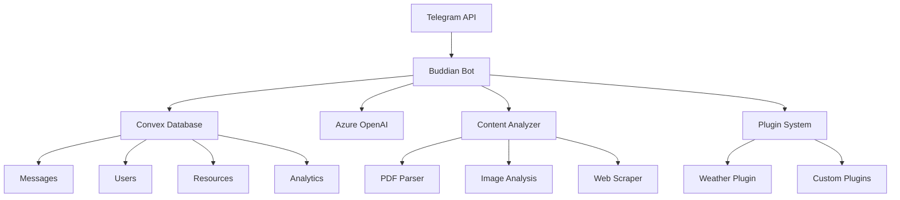

# Buddian - AI-Powered Telegram Bot

[](https://opensource.org/licenses/MIT)
[](https://nodejs.org/)
[](https://www.typescriptlang.org/)
[](https://www.docker.com/)

Buddian is a modular, AI-powered Telegram bot with persistent memory capabilities. It automatically remembers important decisions and action items from conversations, analyzes documents and images, processes web links, and provides intelligent responses based on conversation history.

## 🚀 Features

### Core Capabilities
- **Smart Memory**: Automatically extracts and remembers decisions and action items from conversations
- **Document Analysis**: Processes PDFs, images, and documents with content extraction and summarization
- **Web Content Processing**: Analyzes URLs and extracts key information
- **Multilingual Support**: Detects languages and provides translations (60+ languages supported)
- **Intelligent Q&A**: Answers questions based on conversation history and shared content
- **Full-Text Search**: Search through conversation history and documents

### Advanced Features
- **Plugin System**: Extensible architecture with MCP/A2A protocol compatibility
- **Real-time Processing**: Instant message processing and response generation
- **Content Summarization**: Automatic summaries of conversations and documents
- **Proactive Reminders**: Tracks action items and sends reminders
- **Analytics & Insights**: Usage analytics and conversation insights

## 🏗️ Architecture



## 🛠️ Tech Stack

- **Runtime**: Node.js 18+ with TypeScript
- **Bot Framework**: Telegraf.js
- **Database**: Convex (real-time database)
- **AI/ML**: Azure OpenAI (GPT-4, embeddings)
- **Content Processing**: Sharp, PDF-Parse, Cheerio
- **Infrastructure**: Docker, Nginx, Docker Compose
- **Monitoring**: Structured logging with Pino

## 📦 Quick Start

### Prerequisites

- Node.js 18+ and npm
- Docker and Docker Compose
- Telegram Bot Token (from [@BotFather](https://t.me/BotFather))
- Convex account and project
- Azure OpenAI API access

### 1. Clone and Setup

```bash
git clone https://github.com/your-org/buddian.git
cd buddian

# Copy environment template
cp .env.example .env

# Edit .env with your configuration
nano .env
```

### 2. Configure Environment

```bash
# Required: Telegram Bot Configuration
TELEGRAM_BOT_TOKEN=your_telegram_bot_token_here

# Required: Convex Database
CONVEX_URL=https://your-convex-deployment.convex.cloud
CONVEX_ADMIN_KEY=your_convex_admin_key_here

# Required: Azure OpenAI
AZURE_OPENAI_ENDPOINT=https://your-resource.openai.azure.com/
AZURE_OPENAI_KEY=your_azure_openai_key_here
AZURE_OPENAI_DEPLOYMENT_NAME=gpt-4

# Optional: Azure Computer Vision
AZURE_VISION_ENDPOINT=https://your-vision-resource.cognitiveservices.azure.com/
AZURE_VISION_KEY=your_azure_vision_key_here
```

### 3. Development Setup

```bash
# Install dependencies
npm install

# Set up Convex
npx convex dev

# Start development server
npm run dev
```

### 4. Production Deployment

```bash
# Build and start with Docker Compose
npm run docker:build
npm run docker:up

# Or manually
npm run build
npm start
```

## 🔧 Configuration

### Environment Variables

| Variable | Required | Description |
|----------|----------|-------------|
| `TELEGRAM_BOT_TOKEN` | ✅ | Bot token from @BotFather |
| `CONVEX_URL` | ✅ | Convex deployment URL |
| `CONVEX_ADMIN_KEY` | ✅ | Convex admin key |
| `AZURE_OPENAI_ENDPOINT` | ✅ | Azure OpenAI endpoint |
| `AZURE_OPENAI_KEY` | ✅ | Azure OpenAI API key |
| `AZURE_VISION_ENDPOINT` | ❌ | Azure Computer Vision endpoint |
| `NODE_ENV` | ❌ | Environment (development/production) |
| `LOG_LEVEL` | ❌ | Logging level (debug/info/warn/error) |

### Bot Commands

| Command | Description | Example |
|---------|-------------|---------|
| `/start` | Initialize bot and show welcome message | `/start` |
| `/help` | Show available commands and features | `/help` |
| `/search <query>` | Search conversation history | `/search project deadline` |
| `/summary` | Get conversation summary | `/summary` |
| `/translate <text>` | Translate text | `/translate Hello world` |
| `/remind` | Show pending action items | `/remind` |
| `/settings` | View and manage preferences | `/settings` |
| `/ping` | Health check and system status | `/ping` |

## 🔌 Plugin Development

Buddian supports a powerful plugin system compatible with MCP (Model Context Protocol) and A2A (Agent-to-Agent) standards.

### Creating a Plugin

```typescript
import { BuddianPlugin, PluginContext, PluginResult } from '@buddian/plugins';

export class MyPlugin implements BuddianPlugin {
  readonly metadata = {
    id: 'my-plugin',
    name: 'My Custom Plugin',
    version: '1.0.0',
    description: 'A custom plugin for Buddian',
    author: 'Your Name'
  };

  async activate(context: PluginContext): Promise<void> {
    console.log('Plugin activated');
  }

  async executeCommand(
    command: string,
    parameters: Record<string, any>,
    context: PluginContext
  ): Promise<PluginResult> {
    // Plugin logic here
    return {
      success: true,
      message: 'Command executed successfully'
    };
  }
}
```

### Plugin Examples

- **Weather Plugin**: Get weather information and forecasts
- **Calendar Plugin**: Manage events and reminders
- **Task Manager**: Advanced task tracking and management
- **Analytics Plugin**: Generate usage reports and insights

## 📊 Monitoring & Analytics

### Health Endpoints

- `GET /health` - Basic health check
- `GET /api/stats` - System statistics
- `GET /api/metrics` - Detailed metrics

### Logging

Structured logging with correlation IDs:

```json
{
  "level": "info",
  "time": "2024-01-15T10:30:00.000Z",
  "component": "bot",
  "requestId": "req_1705312200000_1",
  "userId": "123456789",
  "chatId": "-987654321",
  "action": "message_processed",
  "duration": 150,
  "msg": "Message processed successfully"
}
```

## 🚀 Deployment

### Docker Compose (Recommended)

```bash
# Production deployment
docker-compose up -d

# View logs
docker-compose logs -f

# Scale services
docker-compose up -d --scale bot=3
```

### Manual Deployment

```bash
# Build the application
npm run build

# Start production server
NODE_ENV=production npm start
```

### Nginx Configuration

The included Nginx configuration provides:
- SSL termination
- Rate limiting
- Health checks
- Subdomain routing
- Security headers

## 🔒 Security

### Best Practices

- Store sensitive data in environment variables
- Use HTTPS in production
- Implement rate limiting
- Regular security updates
- Monitor for suspicious activity

### Authentication

- Telegram webhook validation
- API key authentication for external services
- Basic auth for admin interfaces

## 🧪 Testing

```bash
# Run tests
npm test

# Run with coverage
npm run test:coverage

# Integration tests
npm run test:integration

# Load testing
npm run test:load
```

## 📈 Performance

### Optimization Features

- Connection pooling
- Response caching
- Lazy loading
- Batch processing
- Memory management

### Scaling

- Horizontal scaling with Docker
- Database connection pooling
- CDN for static assets
- Load balancing with Nginx

## 🤝 Contributing

We welcome contributions! Please see our [Contributing Guide](CONTRIBUTING.md) for details.

### Development Workflow

1. Fork the repository
2. Create a feature branch
3. Make your changes
4. Add tests
5. Submit a pull request

### Code Style

- TypeScript with strict mode
- ESLint + Prettier
- Conventional commits
- Comprehensive documentation

## 📄 License

This project is licensed under the MIT License - see the [LICENSE](LICENSE) file for details.

## 🆘 Support

### Documentation

- [API Documentation](docs/api.md)
- [Plugin Development Guide](docs/plugins.md)
- [Deployment Guide](docs/deployment.md)
- [Troubleshooting](docs/troubleshooting.md)

### Community

- [GitHub Issues](https://github.com/your-org/buddian/issues)
- [Discussions](https://github.com/your-org/buddian/discussions)
- [Discord Server](https://discord.gg/buddian)

### Commercial Support

For enterprise support, custom development, or consulting services, contact us at [support@buddian.com](mailto:support@buddian.com).

## 🙏 Acknowledgments

- [Telegraf.js](https://telegraf.js.org/) - Telegram bot framework
- [Convex](https://convex.dev/) - Real-time database
- [Azure OpenAI](https://azure.microsoft.com/en-us/products/ai-services/openai-service) - AI services
- [Docker](https://www.docker.com/) - Containerization
- [Nginx](https://nginx.org/) - Web server and reverse proxy

---

**Made with ❤️ by the Buddian Team**

*Buddian - Your AI-powered conversation companion*
