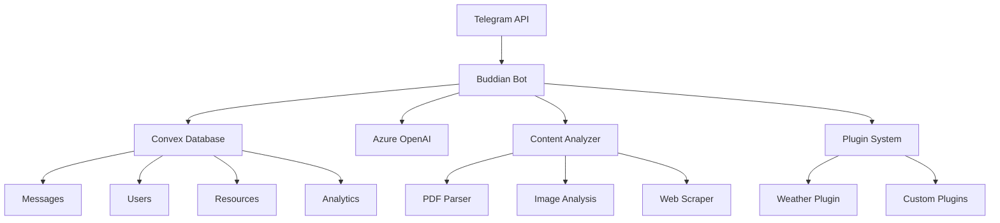

# Buddian - AI-Powered Telegram Bot

[](https://opensource.org/licenses/MIT)
[](https://nodejs.org/)
[](https://www.typescriptlang.org/)
[](https://www.docker.com/)

Buddian is a modular, AI-powered Telegram bot with persistent memory capabilities. It automatically remembers important decisions and action items from conversations, analyzes documents and images, processes web links, and provides intelligent responses based on conversation history.

## 🚀 Features

### Core Capabilities
- **Smart Memory**: Automatically extracts and remembers decisions and action items from conversations
- **Document Analysis**: Processes PDFs, images, and documents with content extraction and summarization
- **Web Content Processing**: Analyzes URLs and extracts key information
- **Multilingual Support**: Detects languages and provides translations (60+ languages supported)
- **Intelligent Q&A**: Answers questions based on conversation history and shared content
- **Full-Text Search**: Search through conversation history and documents

### Advanced Features
- **Plugin System**: Extensible architecture with MCP/A2A protocol compatibility
- **Real-time Processing**: Instant message processing and response generation
- **Content Summarization**: Automatic summaries of conversations and documents
- **Proactive Reminders**: Tracks action items and sends reminders
- **Analytics & Insights**: Usage analytics and conversation insights

## 🏗️ Architecture



## 🛠️ Tech Stack

- **Runtime**: Node.js 18+ with TypeScript
- **Bot Framework**: Telegraf.js
- **Database**: Convex (real-time database)
- **AI/ML**: Azure OpenAI (GPT-4, embeddings)
- **Content Processing**: Sharp, PDF-Parse, Cheerio
- **Infrastructure**: Docker, Nginx, Docker Compose
- **Monitoring**: Structured logging with Pino

## 📦 Quick Start

### Prerequisites

- Node.js 18+ and npm
- Docker and Docker Compose
- Telegram Bot Token (from [@BotFather](https://t.me/BotFather))
- Convex account and project
- Azure OpenAI API access

### 1. Clone and Setup

```bash
git clone https://github.com/your-org/buddian.git
cd buddian

# Copy environment template
cp .env.example .env

# Edit .env with your configuration
nano .env
```

### 2. Convex Environment Setup

Buddian uses Convex as its real-time database. The setup process differs between development and production environments:

#### Development Environment Setup

For local development and testing:

```bash
# Install dependencies (includes convex package)
npm install

# Initialize and configure Convex development project
npx convex dev
```

The `npx convex dev` command will:
- Create a new Convex development project (if needed)
- Generate development deployment URL and credentials
- Create `.env.local` file with your development Convex configuration
- Start the Convex development server
- Create database tables automatically from schema

**Development credentials format:**
- `CONVEX_URL`: `https://polished-woodpecker-620.convex.cloud` (example)
- `CONVEX_DEPLOYMENT`: `dev:polished-woodpecker-620`
- `CONVEX_ADMIN_KEY`: Not required for development

#### Production Environment Setup

For Ubuntu server deployment, you need production credentials:

1. **Create Production Deployment**:
   - Go to [Convex Dashboard](https://dashboard.convex.dev)
   - Create a new project or select existing project
   - Navigate to "Settings" → "Deployments"
   - Create a production deployment

2. **Get Production Credentials**:
   - Copy the production deployment URL
   - Generate an admin key in "Settings" → "API Keys"
   - Note the deployment name from the dashboard

**Production credentials format:**
- `CONVEX_URL`: `https://ideal-ermine-213.convex.cloud` (example)
- `CONVEX_DEPLOYMENT`: `prod:ideal-ermine-213`
- `CONVEX_ADMIN_KEY`: `prod:<deployment>|<token>`

#### Database Table Creation

Convex automatically creates database tables from your schema during deployment:

- **Development**: Tables are created when you run `npx convex dev`
- **Production**: Tables are created when you run `npx convex deploy --prod` (or via `RUN_CONVEX_DEPLOY=1 ./deploy.sh` if the CLI is authenticated on the host)
- **Schema**: Defined in `convex/schema.ts` with tables for messages, users, resources, threads, and search

#### Credential Management

**For Local Development:**
```bash
# After running 'npx convex dev', copy values to .env
cp .env.local .env

# Development .env example:
CONVEX_URL=https://polished-woodpecker-620.convex.cloud
CONVEX_DEPLOYMENT=dev:polished-woodpecker-620
CONVEX_ADMIN_KEY=not_required_for_dev
```

**For Production Deployment:**
```bash
# Use production credentials in .env
CONVEX_URL=https://ideal-ermine-213.convex.cloud
CONVEX_DEPLOYMENT=prod:ideal-ermine-213
CONVEX_ADMIN_KEY=prod:ideal-ermine-213|<redacted>
```

#### Environment Migration

When moving from development to production:

1. **Keep Development Setup**: Continue using `npx convex dev` for local development
2. **Add Production Credentials**: Configure production credentials in your server's `.env` file
3. **Deploy Schema**: You must manually deploy your schema to production before running the deployment script
4. **Data Migration**: Use Convex dashboard to export/import data if needed

### 3. Configure Environment

After setting up your Convex environment, complete your `.env` file configuration:

```bash
# Copy Convex configuration (development or production)
# For development: cp .env.local .env
# For production: manually configure with production credentials

# Edit .env with all required configuration
nano .env
```

Complete your `.env` file with all required values:

```bash
# Required: Telegram Bot Configuration
TELEGRAM_BOT_TOKEN=your_telegram_bot_token_here

# Required: Convex Database Configuration
# IMPORTANT: Use PRODUCTION credentials for server deployment
# See .env.example for detailed examples and guidance
CONVEX_URL=https://your-deployment.convex.cloud
CONVEX_DEPLOYMENT=prod:your-deployment-name  # Use 'prod:' for production
CONVEX_ADMIN_KEY=your_production_admin_key_here

# Required: Azure OpenAI
AZURE_OPENAI_ENDPOINT=https://your-resource.openai.azure.com/
AZURE_OPENAI_KEY=your_azure_openai_key_here
AZURE_OPENAI_DEPLOYMENT_NAME=gpt-4

# Optional: Azure Computer Vision
AZURE_VISION_ENDPOINT=https://your-vision-resource.cognitiveservices.azure.com/
AZURE_VISION_KEY=your_azure_vision_key_here
```

### 4. Development Setup

```bash
# Start development server
npm run dev
```

### 5. Production Deployment

**Important**: You must deploy your Convex schema to production before running the deployment script:

```bash
# Step 1: Deploy Convex schema to production (on your dev machine)
npx convex deploy --prod

# Step 2: Then run the deployment script on the server
./deploy.sh
```

The updated deployment script now includes comprehensive Convex setup verification:

```bash
# The deploy.sh script now automatically:
# - Checks for convex dependency in package.json
# - Verifies Convex environment variables are configured
# - Ensures convex/_generated/api.ts exists or can be generated
# - Provides guidance for copying .env.local to .env

# Use the automated deployment script (after schema deployment)
./deploy.sh

# Or manually build and start with Docker Compose
docker compose up -d --build bot

# Note: On the server, do not run npm; use Docker Compose only.
```

#### Convex Setup Troubleshooting

If you encounter Docker build issues related to Convex:

1. **Missing Convex Configuration**: Run `npx convex dev` to configure your project
2. **Environment Variables**: Copy values from `.env.local` to `.env` after running `npx convex dev`
3. **Generated API Files**: The updated `deploy.sh` script will verify these exist or can be generated
4. **Dependency Check**: The script ensures the `convex` package is installed in `packages/bot/package.json`

The deployment script provides detailed guidance and troubleshooting information for common Convex-related build issues.

## 🔧 Configuration

### Environment Variables

| Variable | Required | Description |
|----------|----------|-------------|
| `TELEGRAM_BOT_TOKEN` | ✅ | Bot token from @BotFather |
| `CONVEX_URL` | ✅ | Convex deployment URL |
| `CONVEX_ADMIN_KEY` | ✅ | Convex admin key |
| `AZURE_OPENAI_ENDPOINT` | ✅ | Azure OpenAI endpoint |
| `AZURE_OPENAI_KEY` | ✅ | Azure OpenAI API key |
| `AZURE_VISION_ENDPOINT` | ❌ | Azure Computer Vision endpoint |
| `NODE_ENV` | ❌ | Environment (development/production) |
| `LOG_LEVEL` | ❌ | Logging level (debug/info/warn/error) |

### Bot Commands

| Command | Description | Example |
|---------|-------------|---------|
| `/start` | Initialize bot and show welcome message | `/start` |
| `/help` | Show available commands and features | `/help` |
| `/search <query>` | Search conversation history | `/search project deadline` |
| `/summary` | Get conversation summary | `/summary` |
| `/translate <text>` | Translate text | `/translate Hello world` |
| `/remind` | Show pending action items | `/remind` |
| `/settings` | View and manage preferences | `/settings` |
| `/ping` | Health check and system status | `/ping` |

## 🔌 Plugin Development

Buddian supports a powerful plugin system compatible with MCP (Model Context Protocol) and A2A (Agent-to-Agent) standards.

### Creating a Plugin

```typescript
import { BuddianPlugin, PluginContext, PluginResult } from '@buddian/plugins';

export class MyPlugin implements BuddianPlugin {
  readonly metadata = {
    id: 'my-plugin',
    name: 'My Custom Plugin',
    version: '1.0.0',
    description: 'A custom plugin for Buddian',
    author: 'Your Name'
  };

  async activate(context: PluginContext): Promise<void> {
    console.log('Plugin activated');
  }

  async executeCommand(
    command: string,
    parameters: Record<string, any>,
    context: PluginContext
  ): Promise<PluginResult> {
    // Plugin logic here
    return {
      success: true,
      message: 'Command executed successfully'
    };
  }
}
```

### Plugin Examples

- **Weather Plugin**: Get weather information and forecasts
- **Calendar Plugin**: Manage events and reminders
- **Task Manager**: Advanced task tracking and management
- **Analytics Plugin**: Generate usage reports and insights

## 📊 Monitoring & Analytics

### Health Endpoints

- `GET /health` - Basic health check
- `GET /api/stats` - System statistics
- `GET /api/metrics` - Detailed metrics

### Logging

Structured logging with correlation IDs:

```json
{
  "level": "info",
  "time": "2024-01-15T10:30:00.000Z",
  "component": "bot",
  "requestId": "req_1705312200000_1",
  "userId": "123456789",
  "chatId": "-987654321",
  "action": "message_processed",
  "duration": 150,
  "msg": "Message processed successfully"
}
```

## 🚀 Quick Deployment on Ubuntu 24.04

For rapid deployment on Ubuntu 24.04 servers, you have two options:

### Option 1: Quick Deploy Script (Recommended)

Use the simplified quick-deploy script for fast, reliable deployment:

```bash
# Clone the repository
git clone https://github.com/your-org/buddian.git
cd buddian

# Configure environment variables
cp .env.example .env
nano .env  # Edit with your API keys and configuration

# Run the quick deployment script
./quick-deploy.sh
```

The `quick-deploy.sh` script provides:
- ✅ Simple, reliable deployment process
- ✅ Automatic Docker and Docker Compose checks
- ✅ Environment validation
- ✅ Convex API stub creation (fixes TypeScript compilation issues)
- ✅ Clean Docker build and deployment
- ✅ Service health verification
- ✅ Clear next steps and troubleshooting guidance

### Option 2: Full Deploy Script

Use the comprehensive deployment script for advanced configuration:

```bash
# Run the full deployment script
./deploy.sh
```

The `deploy.sh` script automatically:
- ✅ Checks Docker and Docker Compose installation
- ✅ Validates environment configuration
- ✅ Fixes TypeScript import path issues for Docker builds
- ✅ Cleans up previous Docker builds
- ✅ Builds and deploys all services
- ✅ Verifies deployment health
- ✅ Provides next steps and troubleshooting information

### Manual Deployment

If you prefer manual deployment or encounter issues with the scripts:

```bash
# Ensure Docker is running
sudo systemctl start docker

# Create the Convex API stub (fixes compilation issues)
mkdir -p convex/_generated

# Build and start services
docker compose up -d --build

# Verify deployment
docker compose ps
docker compose logs -f
```

### What the Deployment Script Does

The automated deployment script (`deploy.sh`) handles common Docker build issues and provides a streamlined deployment experience:

1. **Prerequisites Check**: Verifies Docker and Docker Compose are installed and running
2. **Environment Validation**: Ensures `.env` file exists with required configuration
3. **Import Path Fixes**: Automatically resolves TypeScript module resolution issues in Docker builds
4. **Clean Deployment**: Removes old containers and builds fresh images
5. **Health Verification**: Confirms services are running correctly
6. **Guidance**: Provides external nginx configuration examples and next steps

### Troubleshooting Common Issues

If you encounter issues during deployment:

**Docker Build Failures:**
```bash
# Check Docker installation
docker --version
docker compose version

# Verify environment file
cat .env | grep -E "(TELEGRAM|CONVEX|AZURE)"

# Check Convex generated files
ls -la convex/_generated/api.ts
```

**Convex Setup Issues:**
```bash
# Check if Convex API stub exists (should be created automatically)
ls -la convex/_generated/api.ts

# Verify Convex configuration in environment
grep CONVEX .env

# Test Convex connection (if properly configured)
curl -H "Authorization: Bearer $CONVEX_ADMIN_KEY" "$CONVEX_URL/api/health"

# If you see TypeScript compilation errors about missing Convex API:
# The deployment scripts automatically create a working API stub
# This allows the build to succeed while you set up proper Convex configuration
```

**Service Startup Issues:**
```bash
# View service logs
docker compose logs -f bot

# Check service status
docker compose ps

# Restart services if needed
docker compose restart
```

**Webhook Configuration:**
```bash
# Verify webhook status
curl "https://api.telegram.org/bot$TELEGRAM_BOT_TOKEN/getWebhookInfo"

# Test health endpoint
curl -f https://your-domain.com/health
```

### External Nginx Configuration

After running the deployment script, configure your external nginx server to proxy requests to the Buddian services:

```nginx
server {
    listen 80;
    server_name your-domain.com;
    return 301 https://$server_name$request_uri;
}

server {
    listen 443 ssl http2;
    server_name your-domain.com;

    ssl_certificate /path/to/your/certificate.crt;
    ssl_certificate_key /path/to/your/private.key;

    location / {
        proxy_pass http://localhost:8080;
        proxy_set_header Host $host;
        proxy_set_header X-Real-IP $remote_addr;
        proxy_set_header X-Forwarded-For $proxy_add_x_forwarded_for;
        proxy_set_header X-Forwarded-Proto $scheme;
    }
}
```

### Verification Commands

After deployment, verify everything is working:

```bash
# Check service status
docker compose ps

# View logs
docker compose logs -f

# Test health endpoint
curl -f https://your-domain.com/health

# Monitor system resources
docker stats
```

## 🚀 Ubuntu 24.04 Server Deployment

This section provides comprehensive instructions for deploying Buddian on an Ubuntu 24.04 server using Docker Compose with external nginx-host configuration.

### Prerequisites and Server Setup

#### System Requirements
- Ubuntu 24.04 LTS server
- Minimum 2GB RAM, 20GB disk space
- Domain name with DNS configured
- Root or sudo access

#### Install Docker and Dependencies

```bash
# Update system packages
sudo apt update && sudo apt upgrade -y

# Install required packages
sudo apt install -y curl wget git ufw

# Install Docker
curl -fsSL https://get.docker.com -o get-docker.sh
sudo sh get-docker.sh

# Add user to docker group
sudo usermod -aG docker $USER

# Install Docker Compose
sudo apt install -y docker-compose-plugin

# Verify installation
docker --version
docker compose version
```

#### Configure Firewall

```bash
# Configure UFW firewall
sudo ufw allow ssh
sudo ufw allow 80
sudo ufw allow 443
sudo ufw --force enable
```

#### Domain Configuration

Ensure your domain DNS is configured with A records pointing to your server:
- `app.buddian.com` → Your server IP
- `db.buddian.com` → Your server IP  
- `monitoring.buddian.com` → Your server IP

### API Keys and Service Setup

#### 1. Telegram Bot Token

1. Open Telegram and search for [@BotFather](https://t.me/BotFather)
2. Send `/newbot` command
3. Follow prompts to create your bot:
   - Choose a name (e.g., "Buddian Assistant")
   - Choose a username (e.g., "buddian_assistant_bot")
4. Save the bot token (format: `1234567890:ABCdefGHIjklMNOpqrsTUVwxyz`)
5. Configure bot settings:
   ```
   /setdescription - Set bot description
   /setabouttext - Set about text
   /setuserpic - Upload bot avatar
   /setcommands - Set command menu
   ```

#### 2. Convex Database Setup

1. Visit [Convex Dashboard](https://dashboard.convex.dev/)
2. Sign up/login with GitHub account
3. Create new project:
   - Project name: "buddian-production"
   - Select appropriate team/organization
4. Get deployment credentials:
   - Copy `CONVEX_URL` from project dashboard
   - Generate admin key in Settings → API Keys
   - Save `CONVEX_ADMIN_KEY`

#### 3. Azure OpenAI Configuration

1. Login to [Azure Portal](https://portal.azure.com/)
2. Create Azure OpenAI resource:
   - Resource group: Create new or use existing
   - Region: Choose supported region (e.g., East US)
   - Name: "buddian-openai-prod"
   - Pricing tier: Standard S0
3. Deploy models in Azure OpenAI Studio:
   - Deploy GPT-4 model (deployment name: "gpt-4")
   - Deploy text-embedding-ada-002 (deployment name: "text-embedding-ada-002")
4. Get credentials:
   - Copy endpoint URL (format: `https://your-resource.openai.azure.com/`)
   - Copy API key from Keys and Endpoint section

#### 4. Azure Computer Vision (Optional)

1. In Azure Portal, create Computer Vision resource:
   - Resource group: Same as OpenAI
   - Region: Same as OpenAI
   - Name: "buddian-vision-prod"
   - Pricing tier: Free F0 or Standard S1
2. Get credentials:
   - Copy endpoint URL
   - Copy API key

### Environment Configuration

#### Clone Repository

```bash
# Clone the repository
cd /opt
sudo git clone https://github.com/your-org/buddian.git
sudo chown -R $USER:$USER buddian
cd buddian
```

#### Configure Environment Variables

```bash
# Copy environment template
cp .env.example .env

# Edit environment file
nano .env
```

Configure the following variables in `.env`:

```bash
# ===========================================
# TELEGRAM BOT CONFIGURATION
# ===========================================
# Bot token from @BotFather (required)
TELEGRAM_BOT_TOKEN=1234567890:ABCdefGHIjklMNOpqrsTUVwxyz

# ===========================================
# CONVEX DATABASE CONFIGURATION  
# ===========================================
# Convex deployment URL (required)
CONVEX_URL=https://your-convex-deployment.convex.cloud

# Convex admin key for server operations (required)
CONVEX_ADMIN_KEY=your_convex_admin_key_here

# ===========================================
# AZURE OPENAI CONFIGURATION
# ===========================================
# Azure OpenAI endpoint URL (required)
AZURE_OPENAI_ENDPOINT=https://your-resource.openai.azure.com/

# Azure OpenAI API key (required)
AZURE_OPENAI_KEY=your_azure_openai_key_here

# GPT-4 deployment name in Azure OpenAI Studio (required)
AZURE_OPENAI_DEPLOYMENT_NAME=gpt-4

# Text embedding deployment name (required)
AZURE_OPENAI_EMBEDDING_DEPLOYMENT=text-embedding-ada-002

# ===========================================
# AZURE COMPUTER VISION (OPTIONAL)
# ===========================================
# Azure Computer Vision endpoint (optional, for enhanced image analysis)
AZURE_VISION_ENDPOINT=https://your-vision-resource.cognitiveservices.azure.com/

# Azure Computer Vision API key (optional)
AZURE_VISION_KEY=your_azure_vision_key_here

# ===========================================
# PRODUCTION CONFIGURATION
# ===========================================
# Environment setting (production)
NODE_ENV=production

# Logging level for production
LOG_LEVEL=info

# Bot webhook base URL (the app builds the full webhook URL as <BASE_URL>/webhook/telegram)
TELEGRAM_WEBHOOK_BASE_URL=https://app.buddian.com

# IMPORTANT: Telegram webhook secret for security (highly recommended for production)
# Generate a random string (32+ characters). If you intentionally leave this unset,
# remove it from .env and do not pass secret_token in webhook setup.
TELEGRAM_WEBHOOK_SECRET=your_webhook_secret_here

# ===========================================
# SECURITY CONFIGURATION
# ===========================================
# Rate limiting (requests per minute per user)
RATE_LIMIT_PER_MINUTE=30

# Maximum file size for uploads (in MB)
MAX_FILE_SIZE_MB=50
```

### External Nginx Configuration

#### Install Nginx-Host

```bash
# Install nginx
sudo apt install -y nginx

# Enable and start nginx
sudo systemctl enable nginx
sudo systemctl start nginx
```

#### Configure SSL with Let's Encrypt

```bash
# Install certbot
sudo apt install -y certbot python3-certbot-nginx

# Obtain SSL certificates for all subdomains
sudo certbot --nginx -d app.buddian.com -d db.buddian.com -d monitoring.buddian.com

# Verify auto-renewal
sudo certbot renew --dry-run
```

#### Nginx Host Configuration

Create nginx configuration file:

```bash
sudo nano /etc/nginx/sites-available/buddian
```

Add the following configuration:

```nginx
# Buddian Production Configuration
# External nginx-host routing to Docker Compose services

# Rate limiting zones
limit_req_zone $binary_remote_addr zone=api:10m rate=10r/s;
limit_req_zone $binary_remote_addr zone=webhook:10m rate=5r/s;

# Upstream definitions
upstream buddian_bot {
    server localhost:3000;
    keepalive 32;
}

# Bot API - app.buddian.com
server {
    listen 80;
    server_name app.buddian.com;
    return 301 https://$server_name$request_uri;
}

server {
    listen 443 ssl http2;
    server_name app.buddian.com;

    # SSL Configuration (managed by certbot)
    ssl_certificate /etc/letsencrypt/live/app.buddian.com/fullchain.pem;
    ssl_certificate_key /etc/letsencrypt/live/app.buddian.com/privkey.pem;
    include /etc/letsencrypt/options-ssl-nginx.conf;
    ssl_dhparam /etc/letsencrypt/ssl-dhparams.pem;

    # Security headers
    add_header X-Frame-Options DENY;
    add_header X-Content-Type-Options nosniff;
    add_header X-XSS-Protection "1; mode=block";
    add_header Strict-Transport-Security "max-age=31536000; includeSubDomains" always;

    # Bot API endpoints
    location / {
        limit_req zone=api burst=20 nodelay;
        
        proxy_pass http://buddian_bot;
        proxy_http_version 1.1;
        proxy_set_header Upgrade $http_upgrade;
        proxy_set_header Connection 'upgrade';
        proxy_set_header Host $host;
        proxy_set_header X-Real-IP $remote_addr;
        proxy_set_header X-Forwarded-For $proxy_add_x_forwarded_for;
        proxy_set_header X-Forwarded-Proto $scheme;
        proxy_cache_bypass $http_upgrade;
        
        # Timeouts
        proxy_connect_timeout 60s;
        proxy_send_timeout 60s;
        proxy_read_timeout 60s;
    }

    # Telegram webhook endpoint (stricter rate limiting)
    location /webhook/telegram {
        limit_req zone=webhook burst=10 nodelay;
        
        proxy_pass http://buddian_bot;
        proxy_http_version 1.1;
        proxy_set_header Host $host;
        proxy_set_header X-Real-IP $remote_addr;
        proxy_set_header X-Forwarded-For $proxy_add_x_forwarded_for;
        proxy_set_header X-Forwarded-Proto $scheme;
    }

    # Health check endpoint
    location /health {
        proxy_pass http://buddian_bot;
        access_log off;
    }
}

# Convex Dashboard - db.buddian.com  
server {
    listen 80;
    server_name db.buddian.com;
    return 301 https://$server_name$request_uri;
}

server {
    listen 443 ssl http2;
    server_name db.buddian.com;

    # SSL Configuration (managed by certbot)
    ssl_certificate /etc/letsencrypt/live/db.buddian.com/fullchain.pem;
    ssl_certificate_key /etc/letsencrypt/live/db.buddian.com/privkey.pem;
    include /etc/letsencrypt/options-ssl-nginx.conf;
    ssl_dhparam /etc/letsencrypt/ssl-dhparams.pem;

    # Security headers
    add_header X-Frame-Options SAMEORIGIN;
    add_header X-Content-Type-Options nosniff;
    add_header Strict-Transport-Security "max-age=31536000; includeSubDomains" always;

    # Proxy to Convex dashboard
    location / {
        proxy_pass https://dashboard.convex.dev;
        proxy_set_header Host dashboard.convex.dev;
        proxy_set_header X-Real-IP $remote_addr;
        proxy_set_header X-Forwarded-For $proxy_add_x_forwarded_for;
        proxy_set_header X-Forwarded-Proto $scheme;
        proxy_ssl_server_name on;
        proxy_ssl_name dashboard.convex.dev;
    }
}

# Monitoring - monitoring.buddian.com (reserved for future use)
server {
    listen 80;
    server_name monitoring.buddian.com;
    return 301 https://$server_name$request_uri;
}

server {
    listen 443 ssl http2;
    server_name monitoring.buddian.com;

    # SSL Configuration (managed by certbot)
    ssl_certificate /etc/letsencrypt/live/monitoring.buddian.com/fullchain.pem;
    ssl_certificate_key /etc/letsencrypt/live/monitoring.buddian.com/privkey.pem;
    include /etc/letsencrypt/options-ssl-nginx.conf;
    ssl_dhparam /etc/letsencrypt/ssl-dhparams.pem;

    # Placeholder for monitoring dashboard
    location / {
        return 503 "Monitoring dashboard coming soon";
        add_header Content-Type text/plain;
    }
}
```

#### Enable Nginx Configuration

```bash
# Enable the site
sudo ln -s /etc/nginx/sites-available/buddian /etc/nginx/sites-enabled/

# Remove default site
sudo rm -f /etc/nginx/sites-enabled/default

# Test configuration
sudo nginx -t

# Reload nginx
sudo systemctl reload nginx
```

### Docker Compose Deployment

#### Deploy Services

```bash
# Navigate to project directory
cd /opt/buddian

# Pre-create and set permissions for bind-mounted directories
sudo mkdir -p logs uploads
sudo chown -R 1001:1001 logs uploads

# Build and start services (production mode)
docker compose up -d bot

# Note: The nginx compose service is for internal use only and should be started with:
# docker compose --profile internal-proxy up -d nginx

# Verify services are running
docker compose ps

# Check service logs
docker compose logs -f bot
```

#### Configure Convex Schema

```bash
# Deploy Convex schema and functions
docker compose run --rm convex-dev sh -c "convex deploy --prod"

# Verify Convex deployment
docker compose run --rm convex-dev sh -c "convex dashboard"
```

### Post-Deployment Verification

#### Health Checks

```bash
# Test bot service health
curl -f https://app.buddian.com/health

# Check Docker services status
docker compose ps

# Monitor service logs
docker compose logs --tail=50 -f
```

#### Telegram Bot Configuration

```bash
# Set webhook URL (replace with your bot token)
curl -X POST "https://api.telegram.org/bot<YOUR_BOT_TOKEN>/setWebhook" \
     -H "Content-Type: application/json" \
     -d '{"url": "https://app.buddian.com/webhook/telegram", "secret_token": "<YOUR_WEBHOOK_SECRET>"}'

# Verify webhook
curl "https://api.telegram.org/bot<YOUR_BOT_TOKEN>/getWebhookInfo"
```

#### Test Bot Functionality

1. Open Telegram and search for your bot
2. Send `/start` command
3. Test basic functionality:
   - Send a text message
   - Upload an image
   - Share a web link
   - Use `/help` command

#### Monitor System Resources

```bash
# Check system resources
htop

# Monitor Docker containers
docker stats

# Check disk usage
df -h

# Monitor nginx access logs
sudo tail -f /var/log/nginx/access.log
```

### Maintenance and Updates

#### Regular Maintenance Tasks

```bash
# Update system packages (monthly)
sudo apt update && sudo apt upgrade -y

# Renew SSL certificates (automatic, but verify)
sudo certbot renew --dry-run

# Clean Docker resources (weekly)
docker system prune -f

# Backup environment configuration
cp .env .env.backup.$(date +%Y%m%d)
```

#### Update Deployment

```bash
# Navigate to project directory
cd /opt/buddian

# Pull latest changes
git pull origin main

# Rebuild and restart services
docker compose down
docker compose build --no-cache
docker compose up -d

# Deploy updated Convex functions
docker compose run --rm convex-dev sh -c "convex deploy --prod"

# Verify deployment
docker compose logs -f bot
```

#### Monitoring and Logs

```bash
# View real-time logs
docker compose logs -f

# Check specific service logs
docker compose logs bot
docker compose logs nginx

# Monitor system logs
sudo journalctl -u nginx -f
sudo journalctl -u docker -f

# Check nginx error logs
sudo tail -f /var/log/nginx/error.log
```

#### Backup Strategy

```bash
# Create backup script
sudo nano /opt/backup-buddian.sh
```

```bash
#!/bin/bash
# Buddian Backup Script

BACKUP_DIR="/opt/backups/buddian"
DATE=$(date +%Y%m%d_%H%M%S)

# Create backup directory
mkdir -p $BACKUP_DIR

# Backup environment configuration
cp /opt/buddian/.env $BACKUP_DIR/.env.$DATE

# Backup nginx configuration
cp /etc/nginx/sites-available/buddian $BACKUP_DIR/nginx.conf.$DATE

# Note: Convex data is automatically backed up by Convex service
echo "Backup completed: $DATE"
```

```bash
# Make script executable
sudo chmod +x /opt/backup-buddian.sh

# Add to crontab (daily backup at 2 AM)
echo "0 2 * * * /opt/backup-buddian.sh" | sudo crontab -
```

#### Troubleshooting

**Common Issues:**

1. **Bot not responding:**
   ```bash
   # Check bot service status
   docker compose logs bot
   
   # Verify webhook configuration
   curl "https://api.telegram.org/bot<TOKEN>/getWebhookInfo"
   ```

2. **SSL certificate issues:**
   ```bash
   # Renew certificates
   sudo certbot renew --force-renewal
   sudo systemctl reload nginx
   ```

3. **Database connection issues:**
   ```bash
   # Check Convex configuration
   docker compose run --rm convex-dev sh -c "convex dashboard"
   
   # Note: The convex-dev container includes the Convex CLI, while the bot container typically does not.
   # You can also access the Convex dashboard directly at https://dashboard.convex.dev
   
   # Verify environment variables
   docker compose exec bot env | grep CONVEX
   ```

4. **High memory usage:**
   ```bash
   # Restart services
   docker compose restart
   
   # Check resource limits
   docker stats
   ```

**Important Notes:**
- All development tools (npm, node) are containerized - no need to install on Ubuntu server
- The bot service runs on localhost:3000 and is proxied by external nginx-host
- Convex handles database scaling and backups automatically
- Monitor logs regularly for any API rate limiting or quota issues
- Keep API keys secure and rotate them periodically

This deployment configuration provides a production-ready setup with proper security, monitoring, and maintenance procedures for Ubuntu 24.04 servers.

## 🛠️ Troubleshooting

This section addresses common Docker build and deployment issues encountered when setting up Buddian, particularly on Ubuntu 24.04 servers.

### Deploy Script Issues

#### "main: command not found" Error

**Issue**: The deploy.sh script fails with the error `./deploy.sh: line XXX: main: command not found` when running on Ubuntu servers.

**Common Causes**:
1. **File Permissions**: Script lacks execute permissions
2. **Line Endings**: Windows CRLF line endings instead of Unix LF
3. **Shell Compatibility**: Script not running with proper bash shell
4. **Hidden Characters**: Invisible characters in the script file

**Quick Fix - Use the Diagnostic Script**:

The project includes a comprehensive diagnostic and fix script that automatically detects and resolves these issues:

```bash
# Run the diagnostic and fix script
chmod +x fix-deploy.sh
./fix-deploy.sh
```

The `fix-deploy.sh` script will:
- ✅ Check and fix file permissions automatically
- ✅ Convert Windows line endings to Unix format using multiple fallback methods
- ✅ Validate shell compatibility and syntax
- ✅ Test script execution with safe options
- ✅ Create timestamped backups before making changes
- ✅ Provide detailed troubleshooting information

**Environment Variables for fix-deploy.sh**:
- `FIX_ALLOW_INSTALL=1`: Allow automatic installation of dos2unix package
- `FIX_RUN_TEST=1`: Enable actual script execution tests (uses --help and --dry-run)

**Manual Troubleshooting Steps**:

1. **Fix File Permissions**:
   ```bash
   # Add execute permissions
   chmod +x deploy.sh
   
   # Verify permissions
   ls -la deploy.sh
   ```

2. **Fix Line Endings**:
   ```bash
   # Using dos2unix (install if needed)
   sudo apt install dos2unix
   dos2unix deploy.sh
   
   # Or using perl fallback
   perl -pi -e 's/\r$//' deploy.sh
   
   # Or using sed fallback
   sed -i 's/\r$//' deploy.sh
   ```

3. **Check File Format**:
   ```bash
   # Check file type and line endings
   file deploy.sh
   
   # Look for hidden characters
   cat -A deploy.sh | head -20
   ```

4. **Run with Explicit Bash**:
   ```bash
   # Force bash execution
   bash deploy.sh
   
   # Check bash availability
   which bash
   ```

5. **Enable Debug Mode**:
   ```bash
   # Run with debugging enabled
   DEPLOY_DEBUG=1 bash deploy.sh
   
   # Or use bash debug mode
   bash -x deploy.sh
   ```

**Environment Setup for Ubuntu Servers**:

```bash
# Ensure proper environment
export SHELL=/bin/bash
export PATH="/usr/local/bin:/usr/bin:/bin:$PATH"

# Verify system compatibility
uname -a
bash --version
```

**Common Error Messages and Solutions**:

| Error Message | Cause | Solution |
|---------------|-------|----------|
| `main: command not found` | Function not found or script corruption | Use `fix-deploy.sh` or check line endings |
| `Permission denied` | Missing execute permissions | `chmod +x deploy.sh` |
| `bad interpreter` | Wrong shebang or line endings | Convert line endings with `dos2unix` |
| `syntax error` | Script corruption or encoding issues | Re-download script or fix encoding |

#### CRLF Prevention and Windows Setup

**Issue**: Scripts downloaded or edited on Windows systems may have incorrect line endings (CRLF instead of LF), causing execution failures on Linux servers.

**Prevention with .gitattributes**:

The project includes a `.gitattributes` file that automatically ensures correct line endings:

```gitattributes
# Shell scripts should always use LF line endings
*.sh text eol=lf

# Other text files
*.md text
*.json text
*.js text
*.ts text
```

**Windows Development Setup**:

1. **Configure Git for Line Endings**:
   ```bash
   # Set Git to handle line endings automatically
   git config --global core.autocrlf input
   
   # For Windows-only development (not recommended for cross-platform)
   git config --global core.autocrlf true
   ```

2. **Use WSL (Windows Subsystem for Linux)**:
   ```bash
   # Install WSL2 with Ubuntu
   wsl --install -d Ubuntu
   
   # Clone repository in WSL
   cd /mnt/c/projects
   git clone https://github.com/your-org/buddian.git
   cd buddian
   
   # Scripts will have correct line endings
   file deploy.sh  # Should show "ASCII text"
   ```

3. **Configure Your Editor**:
   
   **VS Code**:
   ```json
   // settings.json
   {
     "files.eol": "\n",
     "files.insertFinalNewline": true,
     "files.trimTrailingWhitespace": true
   }
   ```
   
   **Notepad++**:
   - Edit → EOL Conversion → Unix (LF)
   - Settings → Preferences → New Document → Unix (LF)

4. **Verify Line Endings Before Commit**:
   ```bash
   # Check line endings in files
   git ls-files --eol
   
   # Fix line endings if needed
   git add --renormalize .
   git commit -m "Normalize line endings"
   ```

**Troubleshooting Windows-Related Issues**:

1. **Check Current Line Endings**:
   ```bash
   # On Linux/WSL
   file deploy.sh
   hexdump -C deploy.sh | head -5
   
   # Look for \r\n (0d 0a) instead of \n (0a)
   ```

2. **Convert Line Endings**:
   ```bash
   # Multiple methods available in fix-deploy.sh
   FIX_ALLOW_INSTALL=1 ./fix-deploy.sh
   
   # Manual conversion
   dos2unix deploy.sh fix-deploy.sh
   ```

3. **Prevent Future Issues**:
   ```bash
   # Ensure .gitattributes is committed
   git add .gitattributes
   git commit -m "Add gitattributes for line ending consistency"
   
   # Re-normalize repository
   git add --renormalize .
   git commit -m "Normalize all line endings"
   ```

**Best Practices for Cross-Platform Development**:

- **Always use Git**: Clone repositories with Git to respect `.gitattributes`
- **Use WSL on Windows**: Develop in a Linux-like environment
- **Configure editors**: Set editors to use LF line endings
- **Test on target platform**: Always test scripts on the deployment platform
- **Use the fix script**: Run `fix-deploy.sh` when in doubt

**Advanced Debugging**:

```bash
# Check script syntax without execution
bash -n deploy.sh

# Show detailed execution trace
bash -x deploy.sh 2>&1 | tee deploy-debug.log

# Check for specific issues
grep -n "main" deploy.sh
grep -n "function main" deploy.sh
```

If the diagnostic script doesn't resolve the issue, the enhanced deploy.sh script now includes:
- ✅ Built-in environment validation
- ✅ Better error messages with troubleshooting steps
- ✅ Debug mode support (`DEPLOY_DEBUG=1`)
- ✅ Comprehensive file and permission checks
- ✅ Enhanced error handling with line numbers

**Using the Enhanced Deploy Script**:

The updated deploy.sh script includes automatic validation and debugging features:

```bash
# Enable debug mode for detailed output
DEPLOY_DEBUG=1 ./deploy.sh

# The script now automatically:
# - Validates bash environment
# - Checks required files exist
# - Provides detailed error messages
# - Shows troubleshooting steps on failure
```

### Convex Configuration Issues

#### Convex Codegen Failures

**Issue**: Docker build fails with `npx convex codegen` errors or TypeScript compilation errors related to missing `convex/_generated/api` imports.

**Explanation**: The project includes a comprehensive Convex schema but may lack proper configuration for codegen to work in the Docker environment. This is a common issue when:
- Convex project is not properly initialized
- Missing `convex.json` configuration file
- Network issues during Docker build
- Convex authentication not set up

**Current Solution**: The project now includes a **temporary stub solution** that allows the Docker build to succeed while proper Convex configuration is being set up:

1. **Stub API File**: A temporary `convex/_generated/api.ts` file provides the expected API structure
2. **Graceful Fallback**: The Dockerfile creates this stub automatically if codegen fails
3. **Build Success**: TypeScript compilation succeeds using the stub, allowing deployment

**Verification**:
```bash
# Check if stub file exists
ls -la convex/_generated/api.ts

# Verify Docker build succeeds
docker compose build --no-cache bot

# Check build logs for codegen status
docker compose build bot 2>&1 | grep -i convex
```

**Proper Convex Setup** (to replace the stub):

1. **Initialize Convex Project**:
   ```bash
   # Install Convex CLI
   npm install -g convex
   
   # Initialize project (if not already done)
   convex init
   
   # Deploy schema and functions
   convex deploy --prod
   ```

2. **Configure Environment Variables**:
   ```bash
   # Ensure these are set in .env
   CONVEX_URL=https://your-convex-deployment.convex.cloud
   CONVEX_ADMIN_KEY=your_convex_admin_key_here
   ```

3. **Verify Configuration**:
   ```bash
   # Test codegen locally
   npx convex codegen
   
   # Check generated files
   ls -la convex/_generated/
   ```

4. **Replace Stub in Production**:
   ```bash
   # After proper setup, rebuild to use real generated API
   docker compose down
   docker compose build --no-cache bot
   docker compose up -d bot
   ```

#### Understanding the Stub Solution

The temporary stub file (`convex/_generated/api.ts`) includes:

- **All expected API modules**: health, messages, users, resources, threads, search
- **Function signatures**: Matches what the convex service expects to import
- **TypeScript compatibility**: Uses `null as any` to satisfy type checking
- **Runtime safety**: Functions will fail gracefully if called before proper setup

**Important Notes**:
- The stub allows the application to build and deploy successfully
- Convex-dependent features will not work until proper configuration is complete
- The stub should be replaced with actual generated API files for production use
- Monitor logs for Convex-related errors during runtime

#### Convex Authentication Issues

**Issue**: Runtime errors related to Convex authentication or connection failures.

**Diagnosis**:
```bash
# Check Convex connection
docker compose logs bot | grep -i convex

# Test API access
curl -H "Authorization: Bearer $CONVEX_ADMIN_KEY" "$CONVEX_URL/api/health"
```

**Solutions**:
1. **Verify Credentials**: Ensure `CONVEX_URL` and `CONVEX_ADMIN_KEY` are correct
2. **Network Access**: Confirm the container can reach Convex servers
3. **Project Status**: Check Convex dashboard for project status

#### Generated Files Management

**Best Practices**:
- The `convex/_generated/` directory is excluded from Docker build context via `.dockerignore`
- Generated files are created fresh during the Docker build process
- The stub solution ensures builds never fail due to missing generated files
- Proper Convex setup should eventually replace the stub with real generated files

**File Structure**:
```
convex/
├── _generated/          # Generated API files (excluded from git)
│   └── api.ts          # Stub or generated API exports
├── schema.ts           # Database schema definition
├── health.ts           # Health check functions
├── messages.ts         # Message-related functions
├── users.ts            # User management functions
├── resources.ts        # Resource handling functions
├── search.ts           # Search functionality
└── threads.ts          # Thread management functions
```
## 🛠️ Troubleshooting

This section addresses common Docker build and deployment issues encountered when setting up Buddian, particularly on Ubuntu 24.04 servers.

### Convex Configuration Issues

#### Convex Codegen Failures

**Issue**: Docker build fails with `npx convex codegen` errors or TypeScript compilation errors related to missing `convex/_generated/api` imports.

**Explanation**: The project includes a comprehensive Convex schema but may lack proper configuration for codegen to work in the Docker environment. This is a common issue when:
- Convex project is not properly initialized
- Missing `convex.json` configuration file
- Network issues during Docker build
- Convex authentication not set up

**Current Solution**: The project now includes a **temporary stub solution** that allows the Docker build to succeed while proper Convex configuration is being set up:

1. **Stub API File**: A temporary `convex/_generated/api.ts` file provides the expected API structure
2. **Graceful Fallback**: The Dockerfile creates this stub automatically if codegen fails
3. **Build Success**: TypeScript compilation succeeds using the stub, allowing deployment

**Verification**:
```bash
# Check if stub file exists
ls -la convex/_generated/api.ts

# Verify Docker build succeeds
docker compose build --no-cache bot

# Check build logs for codegen status
docker compose build bot 2>&1 | grep -i convex
```

**Proper Convex Setup** (to replace the stub):

1. **Initialize Convex Project**:
   ```bash
   # Install Convex CLI
   npm install -g convex
   
   # Initialize project (if not already done)
   convex init
   
   # Deploy schema and functions
   convex deploy --prod
   ```

2. **Configure Environment Variables**:
   ```bash
   # Ensure these are set in .env
   CONVEX_URL=https://your-convex-deployment.convex.cloud
   CONVEX_ADMIN_KEY=your_convex_admin_key_here
   ```

3. **Verify Configuration**:
   ```bash
   # Test codegen locally
   npx convex codegen
   
   # Check generated files
   ls -la convex/_generated/
   ```

4. **Replace Stub in Production**:
   ```bash
   # After proper setup, rebuild to use real generated API
   docker compose down
   docker compose build --no-cache bot
   docker compose up -d bot
   ```

#### Understanding the Stub Solution

The temporary stub file (`convex/_generated/api.ts`) includes:

- **All expected API modules**: health, messages, users, resources, threads, search
- **Function signatures**: Matches what the convex service expects to import
- **TypeScript compatibility**: Uses `null as any` to satisfy type checking
- **Runtime safety**: Functions will fail gracefully if called before proper setup

**Important Notes**:
- The stub allows the application to build and deploy successfully
- Convex-dependent features will not work until proper configuration is complete
- The stub should be replaced with actual generated API files for production use
- Monitor logs for Convex-related errors during runtime

#### Convex Authentication Issues

**Issue**: Runtime errors related to Convex authentication or connection failures.

**Diagnosis**:
```bash
# Check Convex connection
docker compose logs bot | grep -i convex

# Test API access
curl -H "Authorization: Bearer $CONVEX_ADMIN_KEY" "$CONVEX_URL/api/health"
```

**Solutions**:
1. **Verify Credentials**: Ensure `CONVEX_URL` and `CONVEX_ADMIN_KEY` are correct
2. **Network Access**: Confirm the container can reach Convex servers
3. **Project Status**: Check Convex dashboard for project status

#### Generated Files Management

**Best Practices**:
- The `convex/_generated/` directory is excluded from Docker build context via `.dockerignore`
- Generated files are created fresh during the Docker build process
- The stub solution ensures builds never fail due to missing generated files
- Proper Convex setup should eventually replace the stub with real generated files

**File Structure**:
```
convex/
├── _generated/          # Generated API files (excluded from git)
│   └── api.ts          # Stub or generated API exports
├── schema.ts           # Database schema definition
├── health.ts           # Health check functions
├── messages.ts         # Message-related functions
├── users.ts            # User management functions
├── resources.ts        # Resource handling functions
├── search.ts           # Search functionality
└── threads.ts          # Thread management functions
```

### Docker Build Issues

#### Missing package-lock.json Files

**Issue**: Docker build fails with error `npm ERR! The package-lock.json file was created for a different version of Node.js or npm`

**Explanation**: The Dockerfile has been updated to use `npm install` instead of `npm ci` for fresh deployments. This is expected behavior when deploying without pre-existing lock files.

**Solution**: This is normal and expected. The build process will:
1. Use `npm install` to install dependencies
2. Generate `package-lock.json` files during the build process
3. Create a production-ready container

**Verification**:
```bash
# Check build logs for successful dependency installation
docker compose build --no-cache bot
docker compose logs bot
```

#### Docker Compose Version Warnings

**Issue**: Warning message `version is obsolete` when running `docker compose up`

**Explanation**: The `version: '3.8'` field has been removed from `docker-compose.yml` as it's no longer needed in modern Docker Compose versions.

**Solution**: This warning has been eliminated. If you still see it, ensure you're using the updated `docker-compose.yml` file.

**Verification**:
```bash
# Check Docker Compose version
docker compose version

# Verify no version field in compose file
head -5 docker-compose.yml
```

#### Environment Variable Warnings

**Issue**: Warnings about missing `AZURE_VISION_ENDPOINT` or `AZURE_VISION_KEY` variables

**Explanation**: These variables are optional and have been configured with default empty values using the `${VARIABLE:-}` syntax.

**Solution**: These warnings are eliminated. The Azure Vision variables are truly optional:
- If you have Azure Computer Vision, set them in `.env`
- If you don't need image analysis, leave them unset

**Configuration**:
```bash
# Optional: Add to .env only if you have Azure Computer Vision
AZURE_VISION_ENDPOINT=https://your-vision-resource.cognitiveservices.azure.com/
AZURE_VISION_KEY=your_azure_vision_key_here

# Or leave them unset - the bot will work without image analysis
```

### Build Troubleshooting Commands

#### Clear Docker Build Cache

```bash
# Remove all build cache
docker builder prune -a

# Remove specific images
docker rmi $(docker images -q buddian*)

# Rebuild from scratch
docker compose build --no-cache --pull bot
```

#### Check Build Context Size

```bash
# Check what's being sent to Docker daemon
docker compose build bot 2>&1 | grep "Sending build context"

# Verify .dockerignore is working
docker compose build --progress=plain bot | grep "COPY"
```

#### Debug Build Process

```bash
# Build with detailed output
docker compose build --progress=plain bot

# Build specific stage for debugging
docker build --target=build -f packages/bot/Dockerfile .

# Interactive debugging
docker run -it --rm node:18-alpine sh
```

### Runtime Issues

#### Service Startup Problems

**Issue**: Bot service fails to start or exits immediately

**Diagnosis**:
```bash
# Check service status
docker compose ps

# View detailed logs
docker compose logs --tail=100 bot

# Check container exit code
docker compose ps -a
```

**Common Solutions**:
1. **Environment variables**: Verify all required variables are set
   ```bash
   docker compose exec bot env | grep -E "(TELEGRAM|CONVEX|AZURE)"
   ```

2. **Port conflicts**: Ensure port 3000 is available
   ```bash
   sudo netstat -tlnp | grep :3000
   sudo lsof -i :3000
   ```

3. **Memory issues**: Check available memory
   ```bash
   free -h
   docker stats
   ```

#### Database Connection Issues

**Issue**: Cannot connect to Convex database

**Diagnosis**:
```bash
# Test Convex connection
docker compose run --rm convex-dev sh -c "convex dashboard"

# Check environment variables
docker compose exec bot env | grep CONVEX
```

**Solutions**:
1. **Verify Convex credentials**:
   ```bash
   # Test API access
   curl -H "Authorization: Bearer $CONVEX_ADMIN_KEY" "$CONVEX_URL/api/health"
   ```

2. **Network connectivity**:
   ```bash
   # Test from container
   docker compose exec bot ping -c 3 convex.cloud
   ```

#### Telegram Webhook Issues

**Issue**: Bot doesn't receive messages

**Diagnosis**:
```bash
# Check webhook status
curl "https://api.telegram.org/bot$TELEGRAM_BOT_TOKEN/getWebhookInfo"

# Test webhook endpoint
curl -f https://app.buddian.com/health
```

**Solutions**:
1. **Reset webhook**:
   ```bash
   # Delete existing webhook
   curl -X POST "https://api.telegram.org/bot$TELEGRAM_BOT_TOKEN/deleteWebhook"
   
   # Set new webhook
   curl -X POST "https://api.telegram.org/bot$TELEGRAM_BOT_TOKEN/setWebhook" \
        -H "Content-Type: application/json" \
        -d '{"url": "https://app.buddian.com/webhook/telegram"}'
   ```

2. **Check nginx configuration**:
   ```bash
   sudo nginx -t
   sudo systemctl status nginx
   ```

### Performance Issues

#### High Memory Usage

**Issue**: Container using excessive memory

**Diagnosis**:
```bash
# Monitor container resources
docker stats buddian-bot

# Check Node.js memory usage
docker compose exec bot node -e "console.log(process.memoryUsage())"
```

**Solutions**:
1. **Restart services**:
   ```bash
   docker compose restart bot
   ```

2. **Adjust memory limits**:
   ```yaml
   # Add to docker-compose.yml bot service
   deploy:
     resources:
       limits:
         memory: 1G
       reservations:
         memory: 512M
   ```

#### Slow Response Times

**Issue**: Bot responses are slow

**Diagnosis**:
```bash
# Check response times
curl -w "@curl-format.txt" -o /dev/null -s https://app.buddian.com/health

# Monitor API calls
docker compose logs -f bot | grep -E "(request|response|duration)"
```

**Solutions**:
1. **Check Azure OpenAI quotas**:
   - Monitor API usage in Azure Portal
   - Verify rate limits aren't exceeded

2. **Optimize database queries**:
   - Check Convex dashboard for slow queries
   - Monitor database performance metrics

### Log Analysis

#### Structured Log Analysis

```bash
# Filter logs by level
docker compose logs bot | grep '"level":"error"'

# Search for specific errors
docker compose logs bot | grep -i "timeout\|connection\|failed"

# Monitor real-time errors
docker compose logs -f bot | grep '"level":"error"'
```

#### Common Error Patterns

1. **Rate Limiting**:
   ```bash
   # Look for rate limit errors
   docker compose logs bot | grep -i "rate.limit\|429\|quota"
   ```

2. **Authentication Errors**:
   ```bash
   # Check for auth failures
   docker compose logs bot | grep -i "unauthorized\|401\|403\|invalid.key"
   ```

3. **Network Issues**:
   ```bash
   # Monitor network errors
   docker compose logs bot | grep -i "timeout\|connection.refused\|dns"
   ```

### System Health Checks

#### Comprehensive Health Check

```bash
#!/bin/bash
# Buddian Health Check Script

echo "=== Buddian System Health Check ==="

# Docker services
echo "1. Docker Services:"
docker compose ps

# Service health endpoints
echo "2. Health Endpoints:"
curl -f https://app.buddian.com/health || echo "Health check failed"

# System resources
echo "3. System Resources:"
free -h
df -h /

# Network connectivity
echo "4. Network Tests:"
ping -c 3 api.telegram.org
ping -c 3 convex.cloud

# SSL certificates
echo "5. SSL Status:"
echo | openssl s_client -servername app.buddian.com -connect app.buddian.com:443 2>/dev/null | openssl x509 -noout -dates

echo "=== Health Check Complete ==="
```

#### Automated Monitoring

```bash
# Add to crontab for regular health checks
echo "*/5 * * * * /opt/buddian/health-check.sh >> /var/log/buddian-health.log 2>&1" | crontab -
```

### Recovery Procedures

#### Complete Service Recovery

```bash
# Full service restart
docker compose down
docker compose pull
docker compose up -d

# Verify recovery
docker compose ps
docker compose logs -f bot
```

#### Database Recovery

```bash
# Redeploy Convex schema
docker compose run --rm convex-dev sh -c "convex deploy --prod"

# Verify database connectivity
docker compose exec bot node -e "console.log('Database test')"
```

#### Emergency Rollback

```bash
# Rollback to previous version
git log --oneline -10
git checkout <previous-commit>
docker compose down
docker compose build --no-cache
docker compose up -d
```

### Getting Help

If you encounter issues not covered in this troubleshooting guide:

1. **Check logs first**: Always start with `docker compose logs bot`
2. **Search existing issues**: Check [GitHub Issues](https://github.com/your-org/buddian/issues)
3. **Provide context**: Include logs, environment details, and steps to reproduce
4. **System information**: Include Ubuntu version, Docker version, and hardware specs

**Useful debugging information to include**:
```

### Best Practices

- Store sensitive data in environment variables
- Use HTTPS in production
- Implement rate limiting
- Regular security updates
- Monitor for suspicious activity

### Authentication

- Telegram webhook validation
- API key authentication for external services
- Basic auth for admin interfaces

#### Convex Admin Key Security

**Important Security Notice**: This application uses Convex admin keys for database operations, which provides full administrative access to the Convex database. This approach is used for the following reasons:

**Current Implementation**:
- The bot service uses `CONVEX_ADMIN_KEY` for all database operations
- Admin keys bypass all authentication and authorization rules
- This provides full read/write access to all data in the Convex database

**Security Implications**:
- **High Privilege**: Admin keys have unrestricted access to all database operations
- **No User Context**: Operations are performed as admin, not as individual users
- **Audit Trail**: All operations appear as admin actions in Convex logs
- **Key Exposure Risk**: If the admin key is compromised, full database access is granted

**Security Measures in Place**:
- Admin key is stored as an environment variable (`CONVEX_ADMIN_KEY`)
- Key is not logged or exposed in application logs
- Container environment isolates the key from the host system
- HTTPS encryption protects key transmission to Convex servers

**Recommended Security Practices**:
1. **Rotate Keys Regularly**: Generate new admin keys periodically in Convex dashboard
2. **Restrict Network Access**: Use firewall rules to limit outbound connections
3. **Monitor Usage**: Review Convex dashboard logs for unusual activity
4. **Environment Security**: Secure the `.env` file with appropriate file permissions (600)
5. **Container Security**: Keep Docker images updated and scan for vulnerabilities

**Alternative Authentication Approaches** (for future consideration):
- **User-based Auth**: Implement Convex user authentication with proper user sessions
- **Service Accounts**: Use dedicated service accounts with limited permissions
- **JWT Tokens**: Implement token-based authentication with expiration
- **Role-based Access**: Define specific roles with minimal required permissions

**Migration Path**:
To improve security, consider migrating to user-based authentication:
1. Implement Convex user authentication system
2. Create service-specific user accounts with limited permissions
3. Replace admin key usage with user session tokens
4. Implement proper authorization checks in Convex functions

For production deployments, evaluate whether the current admin key approach meets your security requirements, or if implementing user-based authentication would be more appropriate for your use case.

## 🧪 Testing

```bash
# Run tests
npm test

# Run with coverage
npm run test:coverage

# Integration tests
npm run test:integration

# Load testing
npm run test:load
```

## 📈 Performance

### Optimization Features

- Connection pooling
- Response caching
- Lazy loading
- Batch processing
- Memory management

### Scaling

- Horizontal scaling with Docker
- Database connection pooling
- CDN for static assets
- Load balancing with Nginx

## 🤝 Contributing

We welcome contributions! Please see our [Contributing Guide](CONTRIBUTING.md) for details.

### Development Workflow

1. Fork the repository
2. Create a feature branch
3. Make your changes
4. Add tests
5. Submit a pull request

### Code Style

- TypeScript with strict mode
- ESLint + Prettier
- Conventional commits
- Comprehensive documentation

## 📄 License

This project is licensed under the MIT License - see the [LICENSE](LICENSE) file for details.

## 🆘 Support

### Documentation

- [API Documentation](docs/api.md)
- [Plugin Development Guide](docs/plugins.md)
- [Deployment Guide](docs/deployment.md)
- [Troubleshooting](docs/troubleshooting.md)

### Community

- [GitHub Issues](https://github.com/your-org/buddian/issues)
- [Discussions](https://github.com/your-org/buddian/discussions)
- [Discord Server](https://discord.gg/buddian)

### Commercial Support

For enterprise support, custom development, or consulting services, contact us at [support@buddian.com](mailto:support@buddian.com).

## 🙏 Acknowledgments

- [Telegraf.js](https://telegraf.js.org/) - Telegram bot framework
- [Convex](https://convex.dev/) - Real-time database
- [Azure OpenAI](https://azure.microsoft.com/en-us/products/ai-services/openai-service) - AI services
- [Docker](https://www.docker.com/) - Containerization
- [Nginx](https://nginx.org/) - Web server and reverse proxy

---

**Made with ❤️ by the Buddian Team**

*Buddian - Your AI-powered conversation companion*
