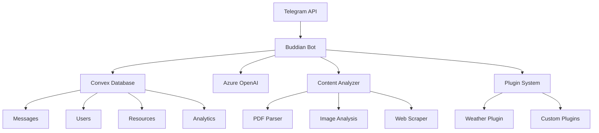

# Buddian - AI-Powered Telegram Bot

[](https://opensource.org/licenses/MIT)
[](https://nodejs.org/)
[](https://www.typescriptlang.org/)
[](https://www.docker.com/)

Buddian is a modular, AI-powered Telegram bot with persistent memory capabilities. It automatically remembers important decisions and action items from conversations, analyzes documents and images, processes web links, and provides intelligent responses based on conversation history.

## 🚀 Features

### Core Capabilities
- **Smart Memory**: Automatically extracts and remembers decisions and action items from conversations
- **Document Analysis**: Processes PDFs, images, and documents with content extraction and summarization
- **Web Content Processing**: Analyzes URLs and extracts key information
- **Multilingual Support**: Detects languages and provides translations (60+ languages supported)
- **Intelligent Q&A**: Answers questions based on conversation history and shared content
- **Full-Text Search**: Search through conversation history and documents

### Advanced Features
- **Plugin System**: Extensible architecture with MCP/A2A protocol compatibility
- **Real-time Processing**: Instant message processing and response generation
- **Content Summarization**: Automatic summaries of conversations and documents
- **Proactive Reminders**: Tracks action items and sends reminders
- **Analytics & Insights**: Usage analytics and conversation insights

## 🏗️ Architecture



## 🛠️ Tech Stack

- **Runtime**: Node.js 18+ with TypeScript
- **Bot Framework**: Telegraf.js
- **Database**: Convex (real-time database)
- **AI/ML**: Azure OpenAI (GPT-4, embeddings)
- **Content Processing**: Sharp, PDF-Parse, Cheerio
- **Infrastructure**: Docker, Nginx, Docker Compose
- **Monitoring**: Structured logging with Pino

## 📦 Quick Start

### Prerequisites

- Node.js 18+ and npm
- Docker and Docker Compose
- Telegram Bot Token (from [@BotFather](https://t.me/BotFather))
- Convex account and project
- Azure OpenAI API access

### 1. Clone and Setup

```bash
git clone https://github.com/your-org/buddian.git
cd buddian

# Copy environment template
cp .env.example .env

# Edit .env with your configuration
nano .env
```

### 2. Configure Environment

```bash
# Required: Telegram Bot Configuration
TELEGRAM_BOT_TOKEN=your_telegram_bot_token_here

# Required: Convex Database
CONVEX_URL=https://your-convex-deployment.convex.cloud
CONVEX_ADMIN_KEY=your_convex_admin_key_here

# Required: Azure OpenAI
AZURE_OPENAI_ENDPOINT=https://your-resource.openai.azure.com/
AZURE_OPENAI_KEY=your_azure_openai_key_here
AZURE_OPENAI_DEPLOYMENT_NAME=gpt-4

# Optional: Azure Computer Vision
AZURE_VISION_ENDPOINT=https://your-vision-resource.cognitiveservices.azure.com/
AZURE_VISION_KEY=your_azure_vision_key_here
```

### 3. Development Setup

```bash
# Install dependencies
npm install

# Set up Convex
npx convex dev

# Start development server
npm run dev
```

### 4. Production Deployment

```bash
# Build and start with Docker Compose
docker compose up -d --build bot

# Note: On the server, do not run npm; use Docker Compose only.
```

## 🔧 Configuration

### Environment Variables

| Variable | Required | Description |
|----------|----------|-------------|
| `TELEGRAM_BOT_TOKEN` | ✅ | Bot token from @BotFather |
| `CONVEX_URL` | ✅ | Convex deployment URL |
| `CONVEX_ADMIN_KEY` | ✅ | Convex admin key |
| `AZURE_OPENAI_ENDPOINT` | ✅ | Azure OpenAI endpoint |
| `AZURE_OPENAI_KEY` | ✅ | Azure OpenAI API key |
| `AZURE_VISION_ENDPOINT` | ❌ | Azure Computer Vision endpoint |
| `NODE_ENV` | ❌ | Environment (development/production) |
| `LOG_LEVEL` | ❌ | Logging level (debug/info/warn/error) |

### Bot Commands

| Command | Description | Example |
|---------|-------------|---------|
| `/start` | Initialize bot and show welcome message | `/start` |
| `/help` | Show available commands and features | `/help` |
| `/search <query>` | Search conversation history | `/search project deadline` |
| `/summary` | Get conversation summary | `/summary` |
| `/translate <text>` | Translate text | `/translate Hello world` |
| `/remind` | Show pending action items | `/remind` |
| `/settings` | View and manage preferences | `/settings` |
| `/ping` | Health check and system status | `/ping` |

## 🔌 Plugin Development

Buddian supports a powerful plugin system compatible with MCP (Model Context Protocol) and A2A (Agent-to-Agent) standards.

### Creating a Plugin

```typescript
import { BuddianPlugin, PluginContext, PluginResult } from '@buddian/plugins';

export class MyPlugin implements BuddianPlugin {
  readonly metadata = {
    id: 'my-plugin',
    name: 'My Custom Plugin',
    version: '1.0.0',
    description: 'A custom plugin for Buddian',
    author: 'Your Name'
  };

  async activate(context: PluginContext): Promise<void> {
    console.log('Plugin activated');
  }

  async executeCommand(
    command: string,
    parameters: Record<string, any>,
    context: PluginContext
  ): Promise<PluginResult> {
    // Plugin logic here
    return {
      success: true,
      message: 'Command executed successfully'
    };
  }
}
```

### Plugin Examples

- **Weather Plugin**: Get weather information and forecasts
- **Calendar Plugin**: Manage events and reminders
- **Task Manager**: Advanced task tracking and management
- **Analytics Plugin**: Generate usage reports and insights

## 📊 Monitoring & Analytics

### Health Endpoints

- `GET /health` - Basic health check
- `GET /api/stats` - System statistics
- `GET /api/metrics` - Detailed metrics

### Logging

Structured logging with correlation IDs:

```json
{
  "level": "info",
  "time": "2024-01-15T10:30:00.000Z",
  "component": "bot",
  "requestId": "req_1705312200000_1",
  "userId": "123456789",
  "chatId": "-987654321",
  "action": "message_processed",
  "duration": 150,
  "msg": "Message processed successfully"
}
```

## 🚀 Ubuntu 24.04 Server Deployment

This section provides comprehensive instructions for deploying Buddian on an Ubuntu 24.04 server using Docker Compose with external nginx-host configuration.

### Prerequisites and Server Setup

#### System Requirements
- Ubuntu 24.04 LTS server
- Minimum 2GB RAM, 20GB disk space
- Domain name with DNS configured
- Root or sudo access

#### Install Docker and Dependencies

```bash
# Update system packages
sudo apt update && sudo apt upgrade -y

# Install required packages
sudo apt install -y curl wget git ufw

# Install Docker
curl -fsSL https://get.docker.com -o get-docker.sh
sudo sh get-docker.sh

# Add user to docker group
sudo usermod -aG docker $USER

# Install Docker Compose
sudo apt install -y docker-compose-plugin

# Verify installation
docker --version
docker compose version
```

#### Configure Firewall

```bash
# Configure UFW firewall
sudo ufw allow ssh
sudo ufw allow 80
sudo ufw allow 443
sudo ufw --force enable
```

#### Domain Configuration

Ensure your domain DNS is configured with A records pointing to your server:
- `app.buddian.com` → Your server IP
- `db.buddian.com` → Your server IP  
- `monitoring.buddian.com` → Your server IP

### API Keys and Service Setup

#### 1. Telegram Bot Token

1. Open Telegram and search for [@BotFather](https://t.me/BotFather)
2. Send `/newbot` command
3. Follow prompts to create your bot:
   - Choose a name (e.g., "Buddian Assistant")
   - Choose a username (e.g., "buddian_assistant_bot")
4. Save the bot token (format: `1234567890:ABCdefGHIjklMNOpqrsTUVwxyz`)
5. Configure bot settings:
   ```
   /setdescription - Set bot description
   /setabouttext - Set about text
   /setuserpic - Upload bot avatar
   /setcommands - Set command menu
   ```

#### 2. Convex Database Setup

1. Visit [Convex Dashboard](https://dashboard.convex.dev/)
2. Sign up/login with GitHub account
3. Create new project:
   - Project name: "buddian-production"
   - Select appropriate team/organization
4. Get deployment credentials:
   - Copy `CONVEX_URL` from project dashboard
   - Generate admin key in Settings → API Keys
   - Save `CONVEX_ADMIN_KEY`

#### 3. Azure OpenAI Configuration

1. Login to [Azure Portal](https://portal.azure.com/)
2. Create Azure OpenAI resource:
   - Resource group: Create new or use existing
   - Region: Choose supported region (e.g., East US)
   - Name: "buddian-openai-prod"
   - Pricing tier: Standard S0
3. Deploy models in Azure OpenAI Studio:
   - Deploy GPT-4 model (deployment name: "gpt-4")
   - Deploy text-embedding-ada-002 (deployment name: "text-embedding-ada-002")
4. Get credentials:
   - Copy endpoint URL (format: `https://your-resource.openai.azure.com/`)
   - Copy API key from Keys and Endpoint section

#### 4. Azure Computer Vision (Optional)

1. In Azure Portal, create Computer Vision resource:
   - Resource group: Same as OpenAI
   - Region: Same as OpenAI
   - Name: "buddian-vision-prod"
   - Pricing tier: Free F0 or Standard S1
2. Get credentials:
   - Copy endpoint URL
   - Copy API key

### Environment Configuration

#### Clone Repository

```bash
# Clone the repository
cd /opt
sudo git clone https://github.com/your-org/buddian.git
sudo chown -R $USER:$USER buddian
cd buddian
```

#### Configure Environment Variables

```bash
# Copy environment template
cp .env.example .env

# Edit environment file
nano .env
```

Configure the following variables in `.env`:

```bash
# ===========================================
# TELEGRAM BOT CONFIGURATION
# ===========================================
# Bot token from @BotFather (required)
TELEGRAM_BOT_TOKEN=1234567890:ABCdefGHIjklMNOpqrsTUVwxyz

# ===========================================
# CONVEX DATABASE CONFIGURATION  
# ===========================================
# Convex deployment URL (required)
CONVEX_URL=https://your-convex-deployment.convex.cloud

# Convex admin key for server operations (required)
CONVEX_ADMIN_KEY=your_convex_admin_key_here

# ===========================================
# AZURE OPENAI CONFIGURATION
# ===========================================
# Azure OpenAI endpoint URL (required)
AZURE_OPENAI_ENDPOINT=https://your-resource.openai.azure.com/

# Azure OpenAI API key (required)
AZURE_OPENAI_KEY=your_azure_openai_key_here

# GPT-4 deployment name in Azure OpenAI Studio (required)
AZURE_OPENAI_DEPLOYMENT_NAME=gpt-4

# Text embedding deployment name (required)
AZURE_OPENAI_EMBEDDING_DEPLOYMENT=text-embedding-ada-002

# ===========================================
# AZURE COMPUTER VISION (OPTIONAL)
# ===========================================
# Azure Computer Vision endpoint (optional, for enhanced image analysis)
AZURE_VISION_ENDPOINT=https://your-vision-resource.cognitiveservices.azure.com/

# Azure Computer Vision API key (optional)
AZURE_VISION_KEY=your_azure_vision_key_here

# ===========================================
# PRODUCTION CONFIGURATION
# ===========================================
# Environment setting (production)
NODE_ENV=production

# Logging level for production
LOG_LEVEL=info

# Bot webhook base URL (the app builds the full webhook URL as <BASE_URL>/webhook/telegram)
TELEGRAM_WEBHOOK_BASE_URL=https://app.buddian.com

# IMPORTANT: Telegram webhook secret for security (highly recommended for production)
# Generate a random string (32+ characters). If you intentionally leave this unset,
# remove it from .env and do not pass secret_token in webhook setup.
TELEGRAM_WEBHOOK_SECRET=your_webhook_secret_here

# ===========================================
# SECURITY CONFIGURATION
# ===========================================
# Rate limiting (requests per minute per user)
RATE_LIMIT_PER_MINUTE=30

# Maximum file size for uploads (in MB)
MAX_FILE_SIZE_MB=50
```

### External Nginx Configuration

#### Install Nginx-Host

```bash
# Install nginx
sudo apt install -y nginx

# Enable and start nginx
sudo systemctl enable nginx
sudo systemctl start nginx
```

#### Configure SSL with Let's Encrypt

```bash
# Install certbot
sudo apt install -y certbot python3-certbot-nginx

# Obtain SSL certificates for all subdomains
sudo certbot --nginx -d app.buddian.com -d db.buddian.com -d monitoring.buddian.com

# Verify auto-renewal
sudo certbot renew --dry-run
```

#### Nginx Host Configuration

Create nginx configuration file:

```bash
sudo nano /etc/nginx/sites-available/buddian
```

Add the following configuration:

```nginx
# Buddian Production Configuration
# External nginx-host routing to Docker Compose services

# Rate limiting zones
limit_req_zone $binary_remote_addr zone=api:10m rate=10r/s;
limit_req_zone $binary_remote_addr zone=webhook:10m rate=5r/s;

# Upstream definitions
upstream buddian_bot {
    server localhost:3000;
    keepalive 32;
}

# Bot API - app.buddian.com
server {
    listen 80;
    server_name app.buddian.com;
    return 301 https://$server_name$request_uri;
}

server {
    listen 443 ssl http2;
    server_name app.buddian.com;

    # SSL Configuration (managed by certbot)
    ssl_certificate /etc/letsencrypt/live/app.buddian.com/fullchain.pem;
    ssl_certificate_key /etc/letsencrypt/live/app.buddian.com/privkey.pem;
    include /etc/letsencrypt/options-ssl-nginx.conf;
    ssl_dhparam /etc/letsencrypt/ssl-dhparams.pem;

    # Security headers
    add_header X-Frame-Options DENY;
    add_header X-Content-Type-Options nosniff;
    add_header X-XSS-Protection "1; mode=block";
    add_header Strict-Transport-Security "max-age=31536000; includeSubDomains" always;

    # Bot API endpoints
    location / {
        limit_req zone=api burst=20 nodelay;
        
        proxy_pass http://buddian_bot;
        proxy_http_version 1.1;
        proxy_set_header Upgrade $http_upgrade;
        proxy_set_header Connection 'upgrade';
        proxy_set_header Host $host;
        proxy_set_header X-Real-IP $remote_addr;
        proxy_set_header X-Forwarded-For $proxy_add_x_forwarded_for;
        proxy_set_header X-Forwarded-Proto $scheme;
        proxy_cache_bypass $http_upgrade;
        
        # Timeouts
        proxy_connect_timeout 60s;
        proxy_send_timeout 60s;
        proxy_read_timeout 60s;
    }

    # Telegram webhook endpoint (stricter rate limiting)
    location /webhook/telegram {
        limit_req zone=webhook burst=10 nodelay;
        
        proxy_pass http://buddian_bot;
        proxy_http_version 1.1;
        proxy_set_header Host $host;
        proxy_set_header X-Real-IP $remote_addr;
        proxy_set_header X-Forwarded-For $proxy_add_x_forwarded_for;
        proxy_set_header X-Forwarded-Proto $scheme;
    }

    # Health check endpoint
    location /health {
        proxy_pass http://buddian_bot;
        access_log off;
    }
}

# Convex Dashboard - db.buddian.com  
server {
    listen 80;
    server_name db.buddian.com;
    return 301 https://$server_name$request_uri;
}

server {
    listen 443 ssl http2;
    server_name db.buddian.com;

    # SSL Configuration (managed by certbot)
    ssl_certificate /etc/letsencrypt/live/db.buddian.com/fullchain.pem;
    ssl_certificate_key /etc/letsencrypt/live/db.buddian.com/privkey.pem;
    include /etc/letsencrypt/options-ssl-nginx.conf;
    ssl_dhparam /etc/letsencrypt/ssl-dhparams.pem;

    # Security headers
    add_header X-Frame-Options SAMEORIGIN;
    add_header X-Content-Type-Options nosniff;
    add_header Strict-Transport-Security "max-age=31536000; includeSubDomains" always;

    # Proxy to Convex dashboard
    location / {
        proxy_pass https://dashboard.convex.dev;
        proxy_set_header Host dashboard.convex.dev;
        proxy_set_header X-Real-IP $remote_addr;
        proxy_set_header X-Forwarded-For $proxy_add_x_forwarded_for;
        proxy_set_header X-Forwarded-Proto $scheme;
        proxy_ssl_server_name on;
        proxy_ssl_name dashboard.convex.dev;
    }
}

# Monitoring - monitoring.buddian.com (reserved for future use)
server {
    listen 80;
    server_name monitoring.buddian.com;
    return 301 https://$server_name$request_uri;
}

server {
    listen 443 ssl http2;
    server_name monitoring.buddian.com;

    # SSL Configuration (managed by certbot)
    ssl_certificate /etc/letsencrypt/live/monitoring.buddian.com/fullchain.pem;
    ssl_certificate_key /etc/letsencrypt/live/monitoring.buddian.com/privkey.pem;
    include /etc/letsencrypt/options-ssl-nginx.conf;
    ssl_dhparam /etc/letsencrypt/ssl-dhparams.pem;

    # Placeholder for monitoring dashboard
    location / {
        return 503 "Monitoring dashboard coming soon";
        add_header Content-Type text/plain;
    }
}
```

#### Enable Nginx Configuration

```bash
# Enable the site
sudo ln -s /etc/nginx/sites-available/buddian /etc/nginx/sites-enabled/

# Remove default site
sudo rm -f /etc/nginx/sites-enabled/default

# Test configuration
sudo nginx -t

# Reload nginx
sudo systemctl reload nginx
```

### Docker Compose Deployment

#### Deploy Services

```bash
# Navigate to project directory
cd /opt/buddian

# Build and start services (production mode)
docker compose up -d bot

# Note: The nginx compose service is for internal use only and should be started with:
# docker compose --profile internal-proxy up -d nginx

# Verify services are running
docker compose ps

# Check service logs
docker compose logs -f bot
```

#### Configure Convex Schema

```bash
# Deploy Convex schema and functions
docker compose run --rm convex-dev sh -c "convex deploy --prod"

# Verify Convex deployment
docker compose run --rm convex-dev sh -c "convex dashboard"
```

### Post-Deployment Verification

#### Health Checks

```bash
# Test bot service health
curl -f https://app.buddian.com/health

# Check Docker services status
docker compose ps

# Monitor service logs
docker compose logs --tail=50 -f
```

#### Telegram Bot Configuration

```bash
# Set webhook URL (replace with your bot token)
curl -X POST "https://api.telegram.org/bot<YOUR_BOT_TOKEN>/setWebhook" \
     -H "Content-Type: application/json" \
     -d '{"url": "https://app.buddian.com/webhook/telegram", "secret_token": "<YOUR_WEBHOOK_SECRET>"}'

# Verify webhook
curl "https://api.telegram.org/bot<YOUR_BOT_TOKEN>/getWebhookInfo"
```

#### Test Bot Functionality

1. Open Telegram and search for your bot
2. Send `/start` command
3. Test basic functionality:
   - Send a text message
   - Upload an image
   - Share a web link
   - Use `/help` command

#### Monitor System Resources

```bash
# Check system resources
htop

# Monitor Docker containers
docker stats

# Check disk usage
df -h

# Monitor nginx access logs
sudo tail -f /var/log/nginx/access.log
```

### Maintenance and Updates

#### Regular Maintenance Tasks

```bash
# Update system packages (monthly)
sudo apt update && sudo apt upgrade -y

# Renew SSL certificates (automatic, but verify)
sudo certbot renew --dry-run

# Clean Docker resources (weekly)
docker system prune -f

# Backup environment configuration
cp .env .env.backup.$(date +%Y%m%d)
```

#### Update Deployment

```bash
# Navigate to project directory
cd /opt/buddian

# Pull latest changes
git pull origin main

# Rebuild and restart services
docker compose down
docker compose build --no-cache
docker compose up -d

# Deploy updated Convex functions
docker compose run --rm convex-dev sh -c "convex deploy --prod"

# Verify deployment
docker compose logs -f bot
```

#### Monitoring and Logs

```bash
# View real-time logs
docker compose logs -f

# Check specific service logs
docker compose logs bot
docker compose logs nginx

# Monitor system logs
sudo journalctl -u nginx -f
sudo journalctl -u docker -f

# Check nginx error logs
sudo tail -f /var/log/nginx/error.log
```

#### Backup Strategy

```bash
# Create backup script
sudo nano /opt/backup-buddian.sh
```

```bash
#!/bin/bash
# Buddian Backup Script

BACKUP_DIR="/opt/backups/buddian"
DATE=$(date +%Y%m%d_%H%M%S)

# Create backup directory
mkdir -p $BACKUP_DIR

# Backup environment configuration
cp /opt/buddian/.env $BACKUP_DIR/.env.$DATE

# Backup nginx configuration
cp /etc/nginx/sites-available/buddian $BACKUP_DIR/nginx.conf.$DATE

# Note: Convex data is automatically backed up by Convex service
echo "Backup completed: $DATE"
```

```bash
# Make script executable
sudo chmod +x /opt/backup-buddian.sh

# Add to crontab (daily backup at 2 AM)
echo "0 2 * * * /opt/backup-buddian.sh" | sudo crontab -
```

#### Troubleshooting

**Common Issues:**

1. **Bot not responding:**
   ```bash
   # Check bot service status
   docker compose logs bot
   
   # Verify webhook configuration
   curl "https://api.telegram.org/bot<TOKEN>/getWebhookInfo"
   ```

2. **SSL certificate issues:**
   ```bash
   # Renew certificates
   sudo certbot renew --force-renewal
   sudo systemctl reload nginx
   ```

3. **Database connection issues:**
   ```bash
   # Check Convex configuration
   docker compose run --rm convex-dev sh -c "convex dashboard"
   
   # Note: The convex-dev container includes the Convex CLI, while the bot container typically does not.
   # You can also access the Convex dashboard directly at https://dashboard.convex.dev
   
   # Verify environment variables
   docker compose exec bot env | grep CONVEX
   ```

4. **High memory usage:**
   ```bash
   # Restart services
   docker compose restart
   
   # Check resource limits
   docker stats
   ```

**Important Notes:**
- All development tools (npm, node) are containerized - no need to install on Ubuntu server
- The bot service runs on localhost:3000 and is proxied by external nginx-host
- Convex handles database scaling and backups automatically
- Monitor logs regularly for any API rate limiting or quota issues
- Keep API keys secure and rotate them periodically

This deployment configuration provides a production-ready setup with proper security, monitoring, and maintenance procedures for Ubuntu 24.04 servers.

## 🔒 Security

### Best Practices

- Store sensitive data in environment variables
- Use HTTPS in production
- Implement rate limiting
- Regular security updates
- Monitor for suspicious activity

### Authentication

- Telegram webhook validation
- API key authentication for external services
- Basic auth for admin interfaces

## 🧪 Testing

```bash
# Run tests
npm test

# Run with coverage
npm run test:coverage

# Integration tests
npm run test:integration

# Load testing
npm run test:load
```

## 📈 Performance

### Optimization Features

- Connection pooling
- Response caching
- Lazy loading
- Batch processing
- Memory management

### Scaling

- Horizontal scaling with Docker
- Database connection pooling
- CDN for static assets
- Load balancing with Nginx

## 🤝 Contributing

We welcome contributions! Please see our [Contributing Guide](CONTRIBUTING.md) for details.

### Development Workflow

1. Fork the repository
2. Create a feature branch
3. Make your changes
4. Add tests
5. Submit a pull request

### Code Style

- TypeScript with strict mode
- ESLint + Prettier
- Conventional commits
- Comprehensive documentation

## 📄 License

This project is licensed under the MIT License - see the [LICENSE](LICENSE) file for details.

## 🆘 Support

### Documentation

- [API Documentation](docs/api.md)
- [Plugin Development Guide](docs/plugins.md)
- [Deployment Guide](docs/deployment.md)
- [Troubleshooting](docs/troubleshooting.md)

### Community

- [GitHub Issues](https://github.com/your-org/buddian/issues)
- [Discussions](https://github.com/your-org/buddian/discussions)
- [Discord Server](https://discord.gg/buddian)

### Commercial Support

For enterprise support, custom development, or consulting services, contact us at [support@buddian.com](mailto:support@buddian.com).

## 🙏 Acknowledgments

- [Telegraf.js](https://telegraf.js.org/) - Telegram bot framework
- [Convex](https://convex.dev/) - Real-time database
- [Azure OpenAI](https://azure.microsoft.com/en-us/products/ai-services/openai-service) - AI services
- [Docker](https://www.docker.com/) - Containerization
- [Nginx](https://nginx.org/) - Web server and reverse proxy

---

**Made with ❤️ by the Buddian Team**

*Buddian - Your AI-powered conversation companion*
